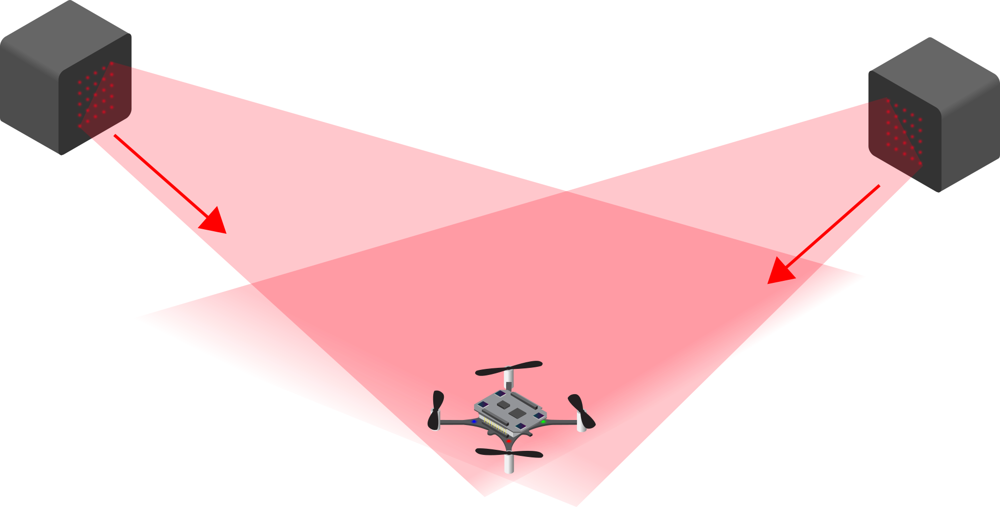

# Crazyflie 2.1 Brushless

Welcome to the **Crazyflie 2.1 Brushless** repository! This repo contains setup notes, troubleshooting tips, and resources for working with the brushless Crazyflie 2.1 nano quadcopter.  

<br>

<div align="center">

</div>

<br>


## Authors
* [Duncan Calvert](https://github.com/duncancalvert)
* [Zachary Farahany](https://github.com/zachfara)
* [Steve Barry](https://github.com/steviebuchicago)


## Contributing
Feel free to fork this repository, submit pull requests, or open issues with suggestions and improvements. If you find this helpful, consider giving it a ⭐ to support the project!


## Installation

### 1. Install the CFClient Globally
1. Navigate to the [Installation Instructions](https://www.bitcraze.io/documentation/repository/crazyflie-clients-python/master/installation/install/) page.  
2. Run:
   ```bash
   python3 -m pip install cfclient
3. Once installed, you can run the clients with:
   ```bash
   * cfclient
   * cfheadless
   * cfloader
   * cfzmq

### 2. Install uv Package Manager
* Run:
   ```bash
   pip install uv

### 3. Create a Virtual Env and Install All Dependecies
* To create a uv virtual env, run: 
   ```bash
   uv venv

* Run:
   ```bash
   uv pip install -r requirements.txt


### 4. Update the Crazyradio 2.0 Firmware
* Follow the [following instructions](https://www.bitcraze.io/documentation/tutorials/getting-started-with-crazyradio-2-0/)
* Note, you will need to update the Crazyradio firmware before updating any deck firmware

<br>

<div align="center">

</div>

<br>

### 5. Update Different Deck Firmwares
* IMPORTANT NOTE - the Crazyflie 2.1 Brushless firmware is "cf21bl" NOT "cf2". You will brick your drone and have to restart in Recovery Mode if you flash the "cf2" firmware.
* If you have issues with firmware flashing, see here for how to boot into [Recovery Mode](https://www.bitcraze.io/documentation/repository/crazyflie-clients-python/master/userguides/recovery-mode/)


#### Flow Deck
The Flow deck lets the drone understand what direction it is moving, hover, and abstracts away the need to write low-level stabilization controls. Importantly, unlike the Lighthouse deck, it does not include a global positioning system, meaning the longer the drone flies, the larger the possible X, Y, Z error rate.
* For installation and flashing instructions, see [Getting Started with the Flow Deck](https://www.bitcraze.io/documentation/tutorials/getting-started-with-flow-deck/)

<br>

<div align="center">

</div>

<br>


#### AI Deck
The AI deck enables WiFi communication as well as onboard neural network processing using the power-efficient GAP8 board. The AI deck also comes with a connected black and white camera with the option of upgrading to a color camera.
* For installation and flashing instructions, see [Getting Started with the AI Deck](https://www.bitcraze.io/documentation/tutorials/getting-started-with-aideck/)

<br>

<div align="center">

</div>

<br>


#### Lighthouse Deck
The Lighthouse positioning system uses a combination of the ground-mounted SteamVR Base stations and the drone-mounted Lighthouse deck. This allows the Crazyflie to estimate its X, Y and Z positions in a global coordinate system with a high degree of accuracy.
* For installationa and setup instructions see [Getting started with the Lighthouse system](https://www.bitcraze.io/documentation/tutorials/getting-started-with-lighthouse/)

<br>

<div align="center">

</div>

<br>

<div align="center">

</div>

<br>


### 6. Create a .env File in Your Repo
* Add your radio URI to it. For Crazyflie 2.1 your radio can be found via the cfclient and generally comes in the form of 'radio://0/80/2M/E7E7E7E7E8'
* Example:
   ```bash
   RADIO_URI='radio://0/80/2M/E7E7E7E7E8'


## Drone Light Indicators
From the crazyflie [light indicators page](https://crazyflie-docs.readthedocs.io/en/latest/getting_started/light_indicators.html)
* 🔵🔵 Two blue = Running correctly
* 🔴🟠 One red + one orange = Error
* 🔴 (fast flashing) = Battery critically low (flash speed reflects level)
* 🔴🔵🔵 (steady) = Low battery
* 🟢🔵🔵 (flashing) = Receiving commands
* 🟢🟠 Green + orange = Drone is sending info
* 🔵🔵 (flashing) = Firmware flashing mode
* 🔴 (5 short pulses + pause) = Self-test failed
   * It could be because of an assert fail(runtime error, i.e. divided by 0), which would be printed in the console. 
   * Restart the Crazyflie if that is the case (and debug).
   * Note: If one Crazyflie does not connect for no apparent reason, then restart it. It may be stuck in an internal loop.

## Crazyradio Light Indicators
* 🟢 Green = Transmitting and receiving correctly
* 🔴 Red = Transmitting but not receiving
* 🔴🟢 Red + Green = Drone is flying
